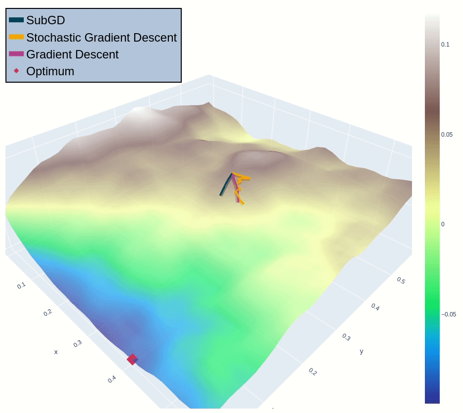
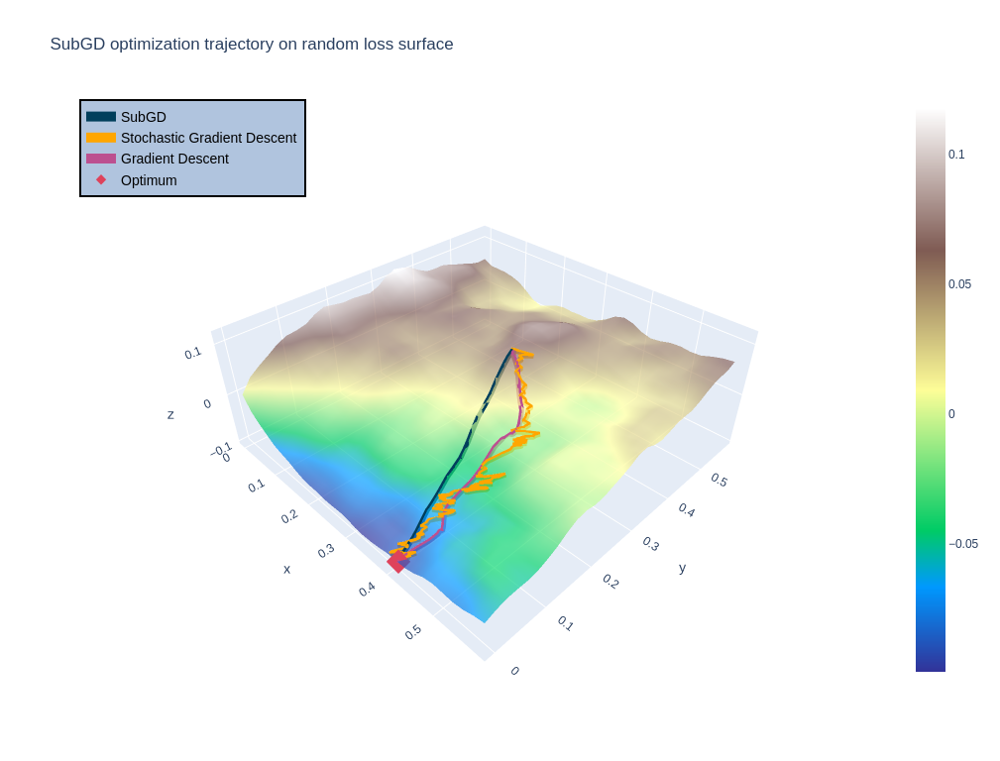
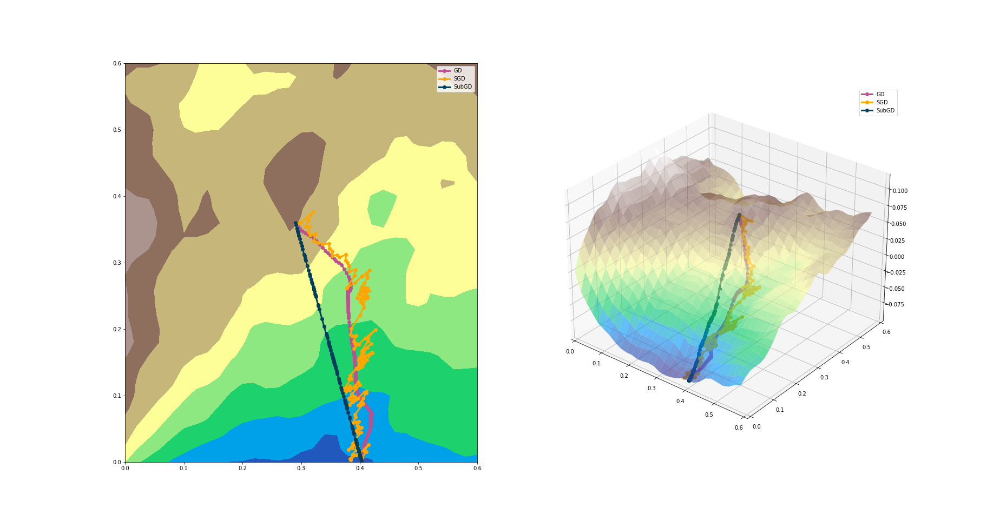
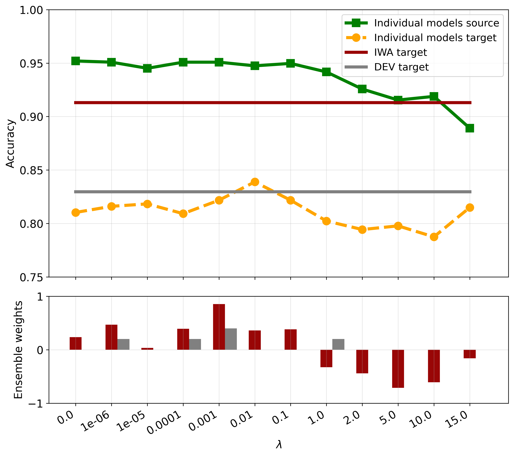
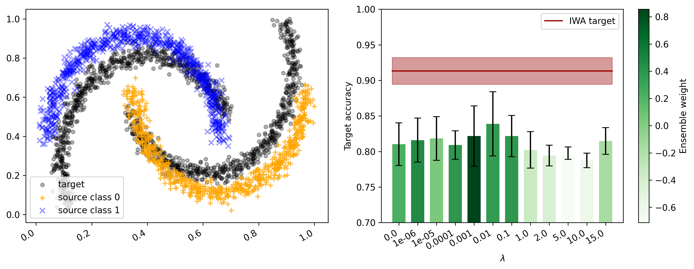

# viz

This repo will serve as a collection of any special visualizations related to machine learning. I try to update it from time to time, whenever I have made up any fancy new plots.

## Gradient Descent Visualization

The module [gd](gd/) contains visualizations in 2D and 3D of gradient descent on arbitrary loss surfaces using interpolation and finite difference gradients. 
It also contains the the code to create the animation. 

Code for the plots shown below can be found in the notebook [3d_gd_subgd.ipynb](gd/3d_gd_subgd.ipynb).

The notebook was originally created for the publication REF.

 
<!--   -->
 

## Presenting Data with Tables and Plots in Notebooks

In the module [data_viz](data_viz/) I show a good practice for visualization of tabular data in Jupyter notebooks. It is also a good example how to your code for data preprocessing and plotting separated and thus modular. Just have a look at the notebook [data_viz_nb.ipynb](data_viz/data_viz_nb.ipynb).

The code was originally created for the publication REF.

 
